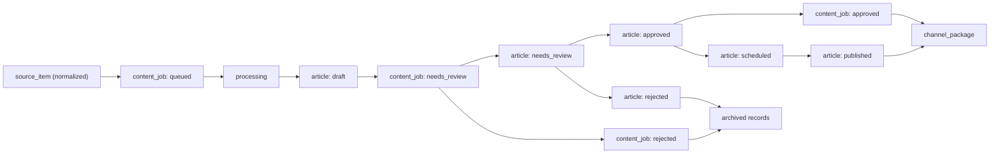

# Engine v0 Review and Publishing Workflow

`Issue #13` turns the editorial workflow into an implementation contract. The engine already has a source registry and normalized source-item shape from [`Issue #12`](./engine-source-registry.md); this document defines what happens after a source item exists.

## Goal

- define the lifecycle from normalized source item to published article
- make review rules explicit enough to implement as code
- separate `content_job`, `article`, and `review_log` into clear responsibilities
- show where manual review still owns the decision and where future automation can take over

## Workflow records

| Record | What it represents | Created when |
| --- | --- | --- |
| `source_item` | one normalized vendor update candidate | after fetch + normalize |
| `content_job` | one attempt to turn a source item into publishable content | when the editorial engine accepts a source item |
| `article` | the web-facing brief or explainer draft | when generation produces a draft body |
| `review_log` | one rule evaluation result attached to either an article or a content job | whenever a rule runs |
| `channel_package` | derived packaging for web index, newsletter, or future dispatch channels | after approval or scheduling |

## Relationship model

The minimum implementation relationship is:

- one `source_item` can spawn zero or more `content_jobs`
- one `content_job` owns exactly one current `article` draft
- one `content_job` can accumulate many `review_logs` during preflight or rejection checks
- one `article` can accumulate many `review_logs` after a draft exists
- one approved `article` can feed many `channel_package` records over time

This allows:

- retries without mutating the original `source_item`
- article rewrites without losing review history
- web publishing and newsletter packaging to diverge while sharing the same approved content source

## State model

The machine-readable definition lives in [`engine/workflow-state.json`](../engine/workflow-state.json).

Config keys stay singular in JSON: `content_job`, `article`, `review_log`, and `channel_package`.

### `content_job.status`

| State | Meaning | Typical owner |
| --- | --- | --- |
| `queued` | accepted candidate, waiting for generation or enrichment | automation |
| `processing` | generation or rule preflight is currently running | automation |
| `needs_review` | draft exists, but a human must check authority, impact, or wording | editor |
| `approved` | job output is editorially valid and can create scheduled channel output | editor |
| `rejected` | candidate should not proceed because it is weak, duplicate, or low-impact | editor |
| `archived` | job is kept for audit, but no longer active | automation or editor |

### `article.review_status`

| State | Meaning | Typical owner |
| --- | --- | --- |
| `draft` | first article body exists, but review has not started | automation |
| `needs_review` | manual review required before any scheduling | editor |
| `approved` | article is clean and can move to channel planning | editor |
| `scheduled` | article is assigned a publish window or batch | editor |
| `published` | article is live on the web surface | automation or editor |
| `rejected` | article draft should not ship | editor |
| `archived` | article is no longer active, but remains for audit and duplicate checks | automation or editor |

### State transitions

## Minimum review rules

The machine-readable rule set lives in [`engine/review-rules.json`](../engine/review-rules.json).

Each rule declares both a `target` and a `phase_field`. In v0, the blocking rules inspect the `article` content but execute against `content_job.status` so preflight and editor checks share the same gate.

The initial blocking rules are:

| Rule key | Why it exists | Blocks approval |
| --- | --- | --- |
| `official_source_first` | prevent non-authoritative briefs | yes |
| `practical_impact_present` | force the article to explain operational or engineering consequences | yes |
| `what_to_do_now_present` | force a concrete action block | yes |
| `cta_present` | keep the article aligned with the site template and user flow | yes |
| `duplicate_title_exact` | stop exact duplicate publish attempts | yes |
| `duplicate_similarity` | flag near-duplicate angles before publish | yes |

Supporting manual checks can still emit warnings instead of hard failure, but the approval gate should not be bypassed if any blocking rule fails.

## Rule execution order

1. `content_job.processing`
   Run deterministic structure checks on the draft and create initial `review_logs`.
2. `content_job.needs_review`
   Human editor confirms authority, impact, audience track, and actionability.
3. `content_job.approved` and `article.approved`
   Approval only happens if all blocking rules are `pass`.
4. `article.scheduled`
   Channel packaging can begin after approval.
5. `article.published`
   Publish writes the final web artifact and closes the workflow loop.

## Publishing layer responsibilities

### Web publish

- writes the article detail page
- updates the homepage/latest queue when relevant
- updates hubs such as briefs, weekly, categories, or tools if the item belongs there

### Newsletter packaging

- groups approved articles into a weekly or campaign batch
- produces newsletter subject, summary blocks, and article order
- does not replace article approval; it consumes already approved content

### Future channel dispatch

- Slack, Telegram, or email snippets should be treated as derived channel packages
- dispatch can be automated later, but only from approved articles
- dispatch failure should not roll back web publication

## Manual review boundary

Manual review still owns:

- deciding whether the update is worth publishing at all
- confirming that the official-source set is sufficient
- checking whether the article really states practical impact
- confirming track fit: `operations`, `engineering`, or `both`
- choosing publish timing, homepage placement, and newsletter inclusion

Automation can own:

- enqueueing jobs from normalized source items
- generating draft bodies and share blocks
- running deterministic review rules
- exact duplicate detection
- preparing web and newsletter packaging records after approval

## Review log contract

`review_logs` are append-only and contain only the following minimal fields.

| Field | Meaning |
| --- | --- |
| `id` | stable log identifier |
| `article_id` | article being checked when the log is article-scoped |
| `content_job_id` | content job being checked when the log is job-scoped |
| `rule_key` | rule that ran |
| `result` | `pass`, `fail`, `warn`, or `skip` |
| `message` | human-readable explanation |
| `created_at` | timestamp of the evaluation |

Exactly one of `article_id` or `content_job_id` must be present on each log entry. This keeps the audit trail stable even if the article or rule definitions evolve.

## Implementation boundary

This slice should stop at workflow definition and config.

Config owns:

- state labels and allowed transitions
- rule definitions and blocking/warning behavior
- channel package types

Code owns:

- job orchestration
- rule execution
- duplicate detection implementation
- article rendering and publish side effects
- newsletter and future channel dispatch adapters

## Files added in this slice

- [`engine/workflow-state.json`](../engine/workflow-state.json)
- [`engine/review-rules.json`](../engine/review-rules.json)

These files are implementation-facing contracts for the next engine issues, not the implementation itself.
